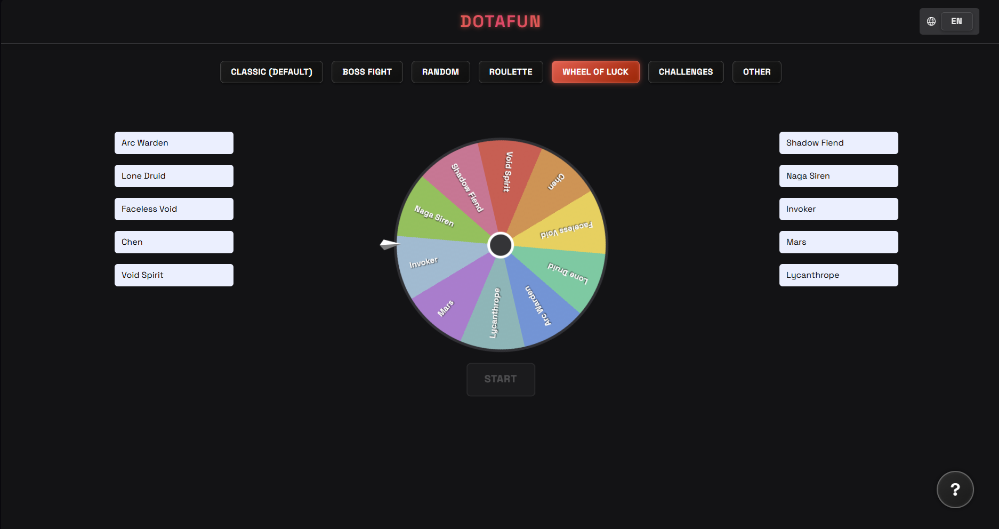

🌐 Available languages: 
[English](https://github.com/Romanus101/dotafun/blob/main/README.md) | 
[Русский](https://github.com/Romanus101/dotafun/blob/main/README.ru.md)

# DOTAFUN 🎮

**DOTAFUN** is a fun web app with a set of mini‑modes for **Dota 2** that adds excitement to the hero selection process and games with friends.  
It includes a roulette, a wheel of luck, challenges, randomizers, and even a mini "fight" mode between heroes.

---

## 🚀 [Open DOTAFUN](https://romanus101.github.io/dotafun/)

---

## ✨ Features

- 🎲 **Classic / Random / Boss fight / Roulette / Wheel of luck / Challenges / Other** — multiple game modes.
- 🃏 **Roulette (CS:GO style)** — a scrolling strip of hero cards, stopping randomly with a highlighted winner.
- 🎡 **Wheel of Luck** — a spinning wheel with sectors and random outcomes.
- ⚔️ **Fight** — mini‑mode: pick heroes on the left and right and "clash" them.
- 🎯 **Challenges** — random tasks for players.
- 🔢 **Random number generator** — generate numbers between chosen min/max.
- 💾 **Downloadable scripts** — small utilities (random keystrokes, alerts).

---

## 🛠️ Tech Stack

- **HTML5 / CSS3 / Tailwind CSS** — layout and styling.  
- **Vanilla JavaScript** — roulette logic, wheel animations, mode switching.  
- **Audio effects** — click and win sounds for atmosphere.  
- **UI/UX details** — winner highlighting, animations, smooth transitions.  

---

## 🚀 Getting Started

1. Clone the repository:
   ```bash
   git clone https://github.com/yourusername/dotafun.git
Open index.html in your browser.

Have fun 🎉

---

## 📸 Screenshots


---

## 🤝 Help with project
You can read about it here:
[CONTRIBUTING](https://github.com/Romanus101/dotafun/blob/main/CONTRIBUTING.md) 

---

## 📜 License
Project is under license [GNU GPL v3](LICENSE).

---
